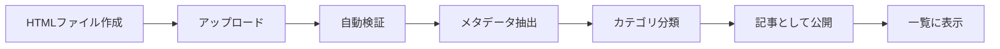

# HTML記事アップロード統合システム設計書

## 概要
HTMLファイル（CSS/JavaScript含む）を外部で作成し、フォルダにアップロードするだけで自動的にニュースポータルに統合されるシステムの設計書です。

## 現在の実装状況

### ✅ すでに実装済みの機能
1. **HTMLファイル自動読み込み**
   - `pub/articles/`フォルダのHTMLファイルを自動的に読み込み
   - ファイル名から日付とスラッグを自動抽出（例: `2024-07-02-mod_ai_dashboard.html`）

2. **スタイル・スクリプト保持**
   - HTMLファイル内のCSSスタイルを保持
   - JavaScriptコードも保持（動的機能の維持）
   - 元のデザインをそのまま表示

3. **メタデータ自動抽出**
   - タイトル（`<title>`タグから）
   - 記事内容
   - カテゴリ推定
   - 読了時間計算

## 提案する拡張設計

### 1. 📁 フォルダ構造

```
defense-intel-news/
├── pub/
│   ├── articles/              # 公開記事フォルダ（現在）
│   │   ├── 2024-07-02-mod_ai_dashboard.html
│   │   └── ...
│   ├── uploads/               # アップロード待機フォルダ（新規）
│   │   └── [新規アップロードファイル]
│   ├── drafts/                # 下書きフォルダ（新規）
│   │   └── [下書き記事]
│   └── archive/               # アーカイブフォルダ（新規）
│       └── [古い記事]
```

### 2. 🎯 HTMLファイル命名規則

#### 必須フォーマット
```
YYYY-MM-DD-{slug}.html
```

#### 例
- `2025-08-24-cyber-defense-strategy.html`
- `2025-08-25-space-force-update.html`

#### オプション: メタデータ付きファイル名
```
YYYY-MM-DD-{category}-{slug}.html
```
- `2025-08-24-technology-ai-warfare.html`
- `2025-08-25-international-china-threat.html`

### 3. 📝 HTMLファイルテンプレート

```html
<!DOCTYPE html>
<html lang="ja">
<head>
    <meta charset="UTF-8">
    <meta name="viewport" content="width=device-width, initial-scale=1.0">
    
    <!-- 必須: タイトル -->
    <title>記事タイトル</title>
    
    <!-- オプション: メタデータ -->
    <meta name="description" content="記事の概要">
    <meta name="author" content="著者名">
    <meta name="category" content="防衛技術">
    <meta name="tags" content="AI,サイバー,防衛">
    <meta name="featured" content="true">
    <meta name="status" content="published">
    
    <!-- カスタムCSS -->
    <style>
        /* 記事固有のスタイル */
        .custom-container {
            max-width: 1200px;
            margin: 0 auto;
            padding: 20px;
        }
    </style>
</head>
<body>
    <!-- 記事コンテンツ -->
    <div class="custom-container">
        <h1>記事タイトル</h1>
        <p>記事内容...</p>
    </div>
    
    <!-- オプション: JavaScript -->
    <script>
        // 記事固有の動的機能
    </script>
</body>
</html>
```

### 4. 🚀 アップロード方法（3つの選択肢）

#### 方法1: 直接フォルダ配置（現在可能）
```bash
# ターミナルやファイルマネージャーで直接配置
cp my-article.html pub/articles/2025-08-24-my-article.html
```

#### 方法2: Web UIアップロード（実装予定）
```typescript
// /app/admin/upload/page.tsx
- ドラッグ&ドロップ対応
- 複数ファイル一括アップロード
- プレビュー機能
- バリデーション
```

#### 方法3: APIエンドポイント（実装予定）
```bash
# REST API経由でアップロード
curl -X POST http://localhost:3002/api/upload \
  -F "file=@my-article.html" \
  -F "category=防衛技術"
```

### 5. 🔄 自動統合プロセス



### 6. ✅ バリデーション機能

#### 自動チェック項目
1. **ファイル名検証**
   - 日付フォーマット確認
   - スラッグの妥当性

2. **HTML構造検証**
   - 必須タグの存在確認（`<title>`）
   - 文字エンコーディング確認（UTF-8）
   - セキュリティチェック（危険なスクリプト）

3. **コンテンツ検証**
   - 最小文字数チェック
   - 画像パスの確認

### 7. 🔧 実装コード例

#### ファイル監視システム
```typescript
// lib/fileWatcher.ts
import { watch } from 'fs';
import path from 'path';

export class ArticleWatcher {
  private watchPath = path.join(process.cwd(), 'pub/uploads');
  
  startWatching() {
    watch(this.watchPath, async (eventType, filename) => {
      if (eventType === 'rename' && filename?.endsWith('.html')) {
        await this.processNewArticle(filename);
      }
    });
  }
  
  async processNewArticle(filename: string) {
    // 1. バリデーション
    const isValid = await this.validateFile(filename);
    if (!isValid) return;
    
    // 2. メタデータ抽出
    const metadata = await ArticleParser.parseFile(filename);
    
    // 3. articlesフォルダに移動
    await this.moveToArticles(filename);
    
    // 4. キャッシュ更新
    await this.updateCache();
  }
}
```

#### アップロードAPI
```typescript
// app/api/upload/route.ts
import { NextRequest, NextResponse } from 'next/server';
import { writeFile } from 'fs/promises';
import path from 'path';

export async function POST(request: NextRequest) {
  const formData = await request.formData();
  const file = formData.get('file') as File;
  
  if (!file || !file.name.endsWith('.html')) {
    return NextResponse.json(
      { error: 'HTMLファイルを選択してください' },
      { status: 400 }
    );
  }
  
  // ファイル名バリデーション
  const datePattern = /^\d{4}-\d{2}-\d{2}-/;
  if (!datePattern.test(file.name)) {
    return NextResponse.json(
      { error: 'ファイル名は YYYY-MM-DD-{slug}.html 形式にしてください' },
      { status: 400 }
    );
  }
  
  // ファイル保存
  const bytes = await file.arrayBuffer();
  const buffer = Buffer.from(bytes);
  const filepath = path.join(process.cwd(), 'pub/articles', file.name);
  
  await writeFile(filepath, buffer);
  
  return NextResponse.json({ 
    success: true, 
    message: '記事がアップロードされました',
    filename: file.name 
  });
}
```

### 8. 🎨 管理画面UI

```typescript
// components/admin/ArticleUploader.tsx
'use client';

import { useState, useCallback } from 'react';
import { Upload, File, CheckCircle, AlertCircle } from 'lucide-react';

export function ArticleUploader() {
  const [isDragging, setIsDragging] = useState(false);
  const [files, setFiles] = useState<File[]>([]);
  
  const handleDrop = useCallback((e: React.DragEvent) => {
    e.preventDefault();
    const droppedFiles = Array.from(e.dataTransfer.files)
      .filter(file => file.name.endsWith('.html'));
    setFiles(droppedFiles);
  }, []);
  
  const uploadFiles = async () => {
    for (const file of files) {
      const formData = new FormData();
      formData.append('file', file);
      
      await fetch('/api/upload', {
        method: 'POST',
        body: formData
      });
    }
  };
  
  return (
    <div 
      className={`border-2 border-dashed rounded-lg p-8 text-center
        ${isDragging ? 'border-blue-500 bg-blue-50' : 'border-gray-300'}`}
      onDragOver={(e) => { e.preventDefault(); setIsDragging(true); }}
      onDragLeave={() => setIsDragging(false)}
      onDrop={handleDrop}
    >
      <Upload className="mx-auto h-12 w-12 text-gray-400" />
      <p className="mt-2 text-gray-600">
        HTMLファイルをドラッグ&ドロップ
      </p>
      <p className="text-sm text-gray-500">
        ファイル名: YYYY-MM-DD-{'{slug}'}.html
      </p>
    </div>
  );
}
```

### 9. 📊 メタデータ管理

#### メタデータJSONファイル（オプション）
```json
// pub/articles/metadata/2024-07-02-mod_ai_dashboard.json
{
  "title": "防衛省AI活用推進基本方針",
  "category": "防衛技術",
  "tags": ["AI", "防衛政策", "技術革新"],
  "author": "防衛情報研究センター",
  "featured": true,
  "priority": "high",
  "relatedArticles": [
    "2024-06-15-ai-ethics",
    "2024-07-10-cyber-defense"
  ],
  "customData": {
    "readingLevel": "専門",
    "targetAudience": "政策立案者"
  }
}
```

### 10. 🔒 セキュリティ考慮事項

1. **XSS対策**
   - 外部スクリプトの除去
   - イベントハンドラの検証

2. **ファイルサイズ制限**
   - 最大10MB/ファイル

3. **ファイルタイプ検証**
   - MIMEタイプチェック
   - 拡張子検証

4. **サンドボックス実行**
   - iframeでのプレビュー（オプション）

## 実装優先順位

### Phase 1: 基本機能（すぐ実装可能）
1. ✅ フォルダ直接配置での自動読み込み（実装済み）
2. ✅ メタデータ自動抽出（実装済み）
3. ⬜ ファイル名バリデーション強化
4. ⬜ エラーハンドリング改善

### Phase 2: Web UI（1-2日）
1. ⬜ アップロード画面作成
2. ⬜ ドラッグ&ドロップ対応
3. ⬜ プレビュー機能
4. ⬜ バリデーション表示

### Phase 3: 高度な機能（3-5日）
1. ⬜ ファイル監視システム
2. ⬜ 自動カテゴリ分類AI
3. ⬜ バージョン管理
4. ⬜ 記事間リンク自動生成

## まとめ

現在のシステムでも、HTMLファイルを`pub/articles/`フォルダに配置するだけで自動的に記事として表示される仕組みは動作しています。

この設計により、以下が実現できます：
- 🎯 **シンプル**: HTMLファイルを作成してフォルダに入れるだけ
- 🔄 **自動化**: メタデータ抽出とカテゴリ分類を自動化
- 🎨 **柔軟性**: 各記事が独自のデザインを持てる
- 🔒 **安全性**: セキュリティチェックを通過したコンテンツのみ公開
- 📈 **拡張性**: 将来的な機能追加が容易

この設計でよろしければ、優先順位に従って実装を進めることができます。